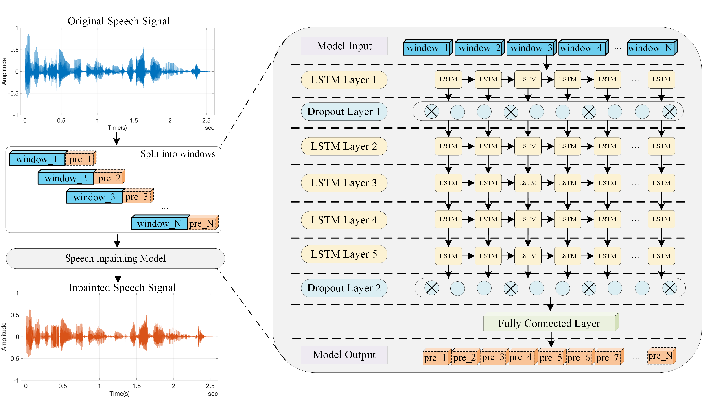
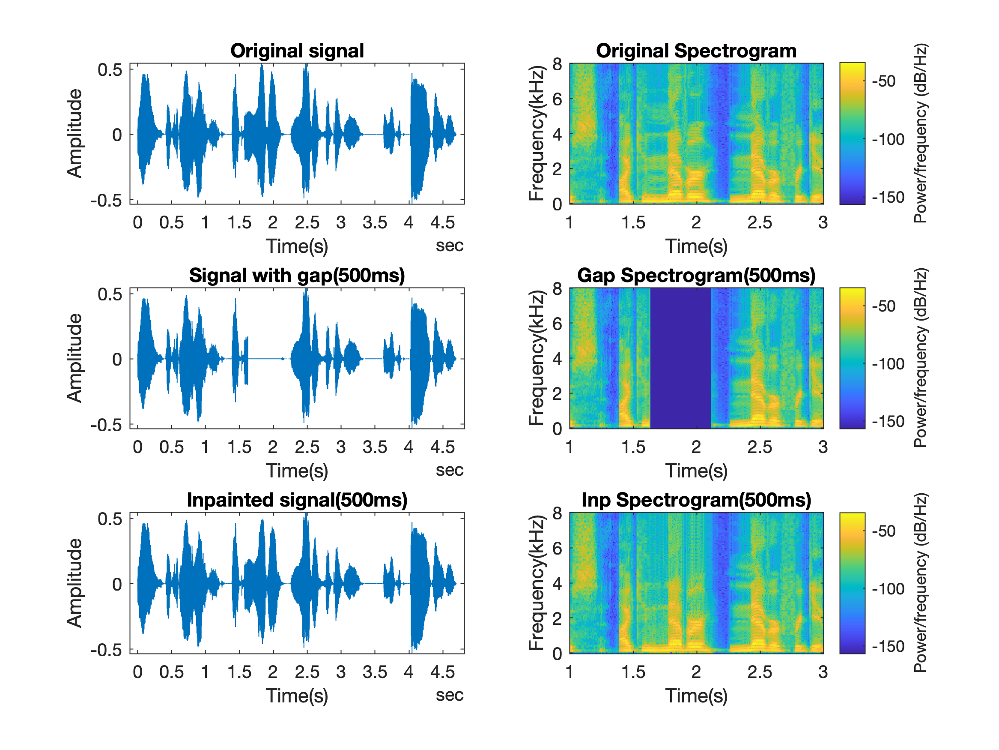

* * *
# 1 Description #

This website presents our solution for the speech inpainting using Long Short-Term Memory (LSTM) networks. We designed multi-layer LSTM networks and trained them with two types of speech datasets, which correspond to four single-speaker and four multi-speaker datasets. Our study aims to investigate the inpainting performance of the proposed models on the different datasets and varying LSTM layers, so as to explore the effect of multi-layer LSTM networks on the prediction of speech samples in terms of perceived audio quality. The inpainted speech quality is evaluated through the Mean Opinion Score (MOS) and frequency analysis of spectrogram.
 
 
In this web page we will examine the performance of the proposed models on the different datasets and learn the performance of the models on the different layers and the different LSTM layers using different strategies.

* * *

# 2 Inpainting process and Model architecture #

The speech inpainting progress and model architecture are shown in Figure 1, the left side of the figure shows the speech inpainting process and the right side shows the structure of the LSTM model, note that only a 5-layer LSTM model is exhibited.
 
 
<!--  During the speech inpainting process, the original speech signals are firstly split into multiple windows, as window_i, &forall; i &isin; [1, N], where N is the total number of windows split from the original speech signal, which corresponds to the blue blocks on the left side in Fig. 1. The length of each window is a fixed value of 640 speech samples, which corresponds to a 40ms speech signal when the signal is sampled at 16kHz.-->

<figure>
  
  <figcaption>Figure 1 - The speech inpainting process and network structure of the proposed LSTM model. 
The orange blocks labelled with pre_i on the right side indicate the predicted parts of the speech, i.e., the inpainted speech. Note that the orange blocks have two border types, the solid line and the dashed line. The dashed line only represents the position relationship between the inpainted signals and window_i, and the solid line represents the inpainted results.</figcaption>
</figure>

* * *
# 3 Inpainting results #
<!-- Here are some examples of the inpainting results. Our tests have demonstrated that the proposed model can generate sufficient accuracy for different gap length, as shown in the following tables. -->

## 3.1 Single-speaker Datasets
* <b> The context of the auido signal is as follows, note that the gap is started from 1.62 seconds and lasted for 1000ms, 500ms, 200ms, 100ms, 50ms, 40ms and 20ms respectively.</b>
* <b>Original Context</b>: No, it’s no use, I can never, never forgive you, and it’s all over.
* <b>Zeroed Context(gap=1000ms)</b>: No, it’s no use, I ca~~n never, never~~ forgive you, and it’s all over.
* <b>Zeroed Context(gap=500ms)</b>: No, it’s no use, I ca~~n never~~ never forgive you, and it’s all over.
* <b>Zeroed Context(gap=200ms)</b>: No, it’s no use, I ca~~n ne~~ver, never forgive you, and it’s all over.
* <b>Zeroed Context(gap=100ms)</b>: No, it’s no use, I ca~~n~~ never, never forgive you, and it’s all over.
* <b>Zeroed Context(gap=50ms)</b>: No, it’s no use, I ca~~n~~ never, never forgive you, and it’s all over.
* <b>Zeroed Context(gap=40ms)</b>: No, it’s no use, I ca~~n~~ never, never forgive you, and it’s all over.
* <b>Zeroed Context(gap=20ms)</b>: No, it’s no use, I ca~~n~~ never, never forgive you, and it’s all over.
### Gap length = 1s
<figure>
  
  <figcaption>Figure 2 - The inpainting results of Original signal, Signal with gap(1000ms) and Inpainted signal in time and frequency domain from top to bottom.</figcaption>
</figure>

<li><audio controls>
<source src="PicandAudio/SingleAudios/original.wav" type="audio/mpeg">
Your browser does not support the audio element.
</audio> Original signal
</li>
<li><audio controls>
<source src="PicandAudio/SingleAudios/gap_1s.wav" type="audio/mpeg">
Your browser does not support the audio element.
</audio> Zeroed signal (Signal with gap)
</li>
<li><audio controls>
<source src="PicandAudio/SingleAudios/inp_1s.wav" type="audio/mpeg">
Your browser does not support the audio element.
</audio> Inpainted signal
</li>

### Gap length = 500ms
<figure>
  
  <figcaption>Figure 3 - The inpainting results of Original signal, Signal with gap(500ms) and Inpainted signal in time and frequency domain from top to bottom.</figcaption>
</figure>

<li><audio controls>
<source src="PicandAudio/SingleAudios/original.wav" type="audio/mpeg">
Your browser does not support the audio element.
</audio> Original signal
</li>
<li><audio controls>
<source src="PicandAudio/SingleAudios/gap_500ms.wav" type="audio/mpeg">
Your browser does not support the audio element.
</audio> Zeroed signal (Signal with gap)
</li>
<li><audio controls>
<source src="PicandAudio/SingleAudios/inp_500ms.wav" type="audio/mpeg">
Your browser does not support the audio element.
</audio> Inpainted signal
</li>

### Gap length = 200ms
 <figure>
  
  <figcaption>Figure 4 - The inpainting results of Original signal, Signal with gap(200ms) and Inpainted signal in time and frequency domain from top to bottom.</figcaption>
</figure>

<li><audio controls>
<source src="PicandAudio/SingleAudios/original.wav" type="audio/mpeg">
Your browser does not support the audio element.
</audio> Original signal
</li>
<li><audio controls>
<source src="PicandAudio/SingleAudios/gap_200ms.wav" type="audio/mpeg">
Your browser does not support the audio element.
</audio> Zeroed signal (Signal with gap)
</li>
<li><audio controls>
<source src="PicandAudio/SingleAudios/inp_200ms.wav" type="audio/mpeg">
Your browser does not support the audio element.
</audio> Inpainted signal
</li>

### Gap length = 100ms
 <figure>
  
  <figcaption>Figure 5 - The inpainting results of Original signal, Signal with gap(100ms) and Inpainted signal in time and frequency domain from top to bottom.</figcaption>
</figure>

<li><audio controls>
<source src="PicandAudio/SingleAudios/original.wav" type="audio/mpeg">
Your browser does not support the audio element.
</audio> Original signal
</li>
<li><audio controls>
<source src="PicandAudio/SingleAudios/gap_100ms.wav" type="audio/mpeg">
Your browser does not support the audio element.
</audio> Zeroed signal (Signal with gap)
</li>
<li><audio controls>
<source src="PicandAudio/SingleAudios/inp_100ms.wav" type="audio/mpeg">
Your browser does not support the audio element.
</audio> Inpainted signal
</li>

### Gap length = 50ms
 <figure>
  
  <figcaption>Figure 6- The inpainting results of Original signal, Signal with gap(50ms) and Inpainted signal in time and frequency domain from top to bottom.</figcaption>
</figure>

<li><audio controls>
<source src="PicandAudio/SingleAudios/original.wav" type="audio/mpeg">
Your browser does not support the audio element.
</audio> Original signal
</li>
<li><audio controls>
<source src="PicandAudio/SingleAudios/gap_50ms.wav" type="audio/mpeg">
Your browser does not support the audio element.
</audio> Zeroed signal (Signal with gap)
</li>
<li><audio controls>
<source src="PicandAudio/SingleAudios/inp_50ms.wav" type="audio/mpeg">
Your browser does not support the audio element.
</audio> Inpainted signal
</li>

### Gap length = 40ms
 <figure>
  
  <figcaption>Figure 7 - The inpainting results of Original signal, Signal with gap(40ms) and Inpainted signal in time and frequency domain from top to bottom.</figcaption>
</figure>

<li><audio controls>
<source src="PicandAudio/SingleAudios/original.wav" type="audio/mpeg">
Your browser does not support the audio element.
</audio> Original signal
</li>
<li><audio controls>
<source src="PicandAudio/SingleAudios/gap_40ms.wav" type="audio/mpeg">
Your browser does not support the audio element.
</audio> Zeroed signal (Signal with gap)
</li>
<li><audio controls>
<source src="PicandAudio/SingleAudios/inp_40ms.wav" type="audio/mpeg">
Your browser does not support the audio element.
</audio> Inpainted signal
</li>

### Gap length = 20ms
 <figure>
  
  <figcaption>Figure 8 - The inpainting results of Original signal, Signal with gap(20ms) and Inpainted signal in time and frequency domain from top to bottom.</figcaption>
</figure>

<li><audio controls>
<source src="PicandAudio/SingleAudios/original.wav" type="audio/mpeg">
Your browser does not support the audio element.
</audio> Original signal
</li>
<li><audio controls>
<source src="PicandAudio/SingleAudios/gap_20ms.wav" type="audio/mpeg">
Your browser does not support the audio element.
</audio> Zeroed signal (Signal with gap)
</li>
<li><audio controls>
<source src="PicandAudio/SingleAudios/inp_20ms.wav" type="audio/mpeg">
Your browser does not support the audio element.
</audio> Inpainted signal
</li>

### MOS

MOS(NB) and MOS(WB) are shown below (single-speaekr).

|   MOS  | 20ms | 40ms  | 50ms | 100ms | 200ms | 500ms | 1000ms |
|:-------|:-----------------------------------------------------|
| MOS_NB | 4.31 | 4.28  | 4.27 | 4.22  | 4.12  | 4.00  |  3.66  |
| MOS_WB | 4.42 | 4.41  | 4.40 | 4.36  | 4.23  | 4.00  |  2.58  |

## 3.2 Multi-speaker Datasets
* <b> The context of the auido signal is as follows, note that the gap is started from 2.88 seconds and lasted for 1000ms, 500ms, 200ms, 100ms, 50ms, 40ms and 20ms respectively.</b>
* <b>Original Context</b>: Then we’ll run home together sometimes he saw her hand stretched out to find his own
* <b>Zeroed Context(gap=1000ms)</b>: Then we’ll run home together ~~sometimes he saw~~ her hand stretched out to find his own
* <b>Zeroed Context(gap=500ms)</b>: Then we’ll run home together ~~sometimes h~~e saw her hand stretched out to find his own
* <b>Zeroed Context(gap=200ms)</b>: Then we’ll run home together ~~some~~times he saw her hand stretched out to find his own
* <b>Zeroed Context(gap=100ms)</b>: Then we’ll run home together ~~s~~ometimes he saw her hand stretched out to find his own
* <b>Zeroed Context(gap=50ms)</b>: Then we’ll run home together ~~s~~ometimes he saw her hand stretched out to find his own
* <b>Zeroed Context(gap=40ms)</b>: Then we’ll run home together ~~s~~ometimes he saw her hand stretched out to find his own
* <b>Zeroed Context(gap=20ms)</b>: Then we’ll run home together ~~s~~ometimes he saw her hand stretched out to find his own
### Gap length = 1s
<figure>
  
  <figcaption>Figure 9 - The inpainting results of Original signal, Signal with gap(1000ms) and Inpainted signal in time and frequency domain from top to bottom.</figcaption>
</figure>

<li><audio controls>
<source src="PicandAudio/MultiAudios/original.wav" type="audio/mpeg">
Your browser does not support the audio element.
</audio> Original signal
</li>
<li><audio controls>
<source src="PicandAudio/MultiAudios/gap_1000ms.wav" type="audio/mpeg">
Your browser does not support the audio element.
</audio> Zeroed signal (Signal with gap)
</li>
<li><audio controls>
<source src="PicandAudio/MultiAudios/inp_1000ms.wav" type="audio/mpeg">
Your browser does not support the audio element.
</audio> Inpainted signal
</li>

### Gap length = 500ms
<figure>
  
  <figcaption>Figure 10 - The inpainting results of Original signal, Signal with gap(500ms) and Inpainted signal in time and frequency domain from top to bottom.</figcaption>
</figure>

<li><audio controls>
<source src="PicandAudio/MultiAudios/original.wav" type="audio/mpeg">
Your browser does not support the audio element.
</audio> Original signal
</li>
<li><audio controls>
<source src="PicandAudio/MultiAudios/gap_500ms.wav" type="audio/mpeg">
Your browser does not support the audio element.
</audio> Zeroed signal (Signal with gap)
</li>
<li><audio controls>
<source src="PicandAudio/MultiAudios/inp_500ms.wav" type="audio/mpeg">
Your browser does not support the audio element.
</audio> Inpainted signal
</li>

### Gap length = 200ms
 <figure>
  
  <figcaption>Figure 11 - The inpainting results of Original signal, Signal with gap(200ms) and Inpainted signal in time and frequency domain from top to bottom.</figcaption>
</figure>

<li><audio controls>
<source src="PicandAudio/MultiAudios/original.wav" type="audio/mpeg">
Your browser does not support the audio element.
</audio> Original signal
</li>
<li><audio controls>
<source src="PicandAudio/MultiAudios/gap_200ms.wav" type="audio/mpeg">
Your browser does not support the audio element.
</audio> Zeroed signal (Signal with gap)
</li>
<li><audio controls>
<source src="PicandAudio/MultiAudios/inp_200ms.wav" type="audio/mpeg">
Your browser does not support the audio element.
</audio> Inpainted signal
</li>

### Gap length = 100ms
 <figure>
  
  <figcaption>Figure 12 - The inpainting results of Original signal, Signal with gap(100ms) and Inpainted signal in time and frequency domain from top to bottom.</figcaption>
</figure>

<li><audio controls>
<source src="PicandAudio/MultiAudios/original.wav" type="audio/mpeg">
Your browser does not support the audio element.
</audio> Original signal
</li>
<li><audio controls>
<source src="PicandAudio/MultiAudios/gap_100ms.wav" type="audio/mpeg">
Your browser does not support the audio element.
</audio> Zeroed signal (Signal with gap)
</li>
<li><audio controls>
<source src="PicandAudio/MultiAudios/inp_100ms.wav" type="audio/mpeg">
Your browser does not support the audio element.
</audio> Inpainted signal
</li>

### Gap length = 50ms
 <figure>
  
  <figcaption>Figure 13 - The inpainting results of Original signal, Signal with gap(50ms) and Inpainted signal in time and frequency domain from top to bottom.</figcaption>
</figure>

<li><audio controls>
<source src="PicandAudio/MultiAudios/original.wav" type="audio/mpeg">
Your browser does not support the audio element.
</audio> Original signal
</li>
<li><audio controls>
<source src="PicandAudio/MultiAudios/gap_50ms.wav" type="audio/mpeg">
Your browser does not support the audio element.
</audio> Zeroed signal (Signal with gap)
</li>
<li><audio controls>
<source src="PicandAudio/MultiAudios/inp_50ms.wav" type="audio/mpeg">
Your browser does not support the audio element.
</audio> Inpainted signal
</li>

### Gap length = 40ms
 <figure>
  
  <figcaption>Figure 14 - The inpainting results of Original signal, Signal with gap(40ms) and Inpainted signal in time and frequency domain from top to bottom.</figcaption>
</figure>

<li><audio controls>
<source src="PicandAudio/MultiAudios/original.wav" type="audio/mpeg">
Your browser does not support the audio element.
</audio> Original signal
</li>
<li><audio controls>
<source src="PicandAudio/MultiAudios/gap_40ms.wav" type="audio/mpeg">
Your browser does not support the audio element.
</audio> Zeroed signal (Signal with gap)
</li>
<li><audio controls>
<source src="PicandAudio/MultiAudios/inp_40ms.wav" type="audio/mpeg">
Your browser does not support the audio element.
</audio> Inpainted signal
</li>

### Gap length = 20ms
 <figure>
  
  <figcaption>Figure 15 - The inpainting results of Original signal, Signal with gap(20ms) and Inpainted signal in time and frequency domain from top to bottom.</figcaption>
</figure>

<li><audio controls>
<source src="PicandAudio/MultiAudios/original.wav" type="audio/mpeg">
Your browser does not support the audio element.
</audio> Original signal
</li>
<li><audio controls>
<source src="PicandAudio/MultiAudios/gap_20ms.wav" type="audio/mpeg">
Your browser does not support the audio element.
</audio> Zeroed signal (Signal with gap)
</li>
<li><audio controls>
<source src="PicandAudio/MultiAudios/inp_20ms.wav" type="audio/mpeg">
Your browser does not support the audio element.
</audio> Inpainted signal
</li>

* * *

### MOS

MOS(NB) and MOS(WB) are shown below (multi-speaekr).

|   MOS  | 20ms | 40ms  | 50ms | 100ms | 200ms | 500ms | 1000ms |
|:-------|:-----------------------------------------------------|
| MOS_NB | 4.08 | 4.07  | 4.06 | 4.02  | 3.29  | 2.75  |  2.16  |
| MOS_WB | 3.92 | 3.85  | 3.84 | 3.85  | 3.44  | 2.76  |  2.03  |
